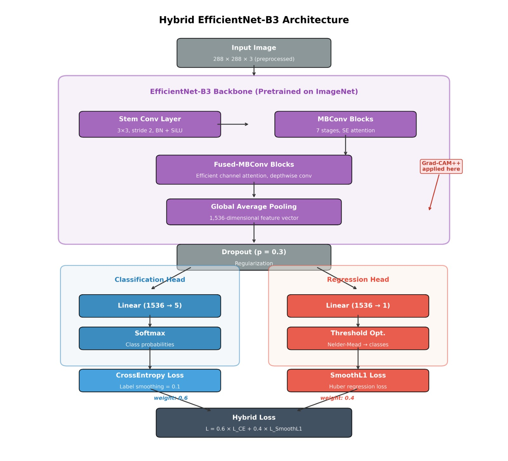
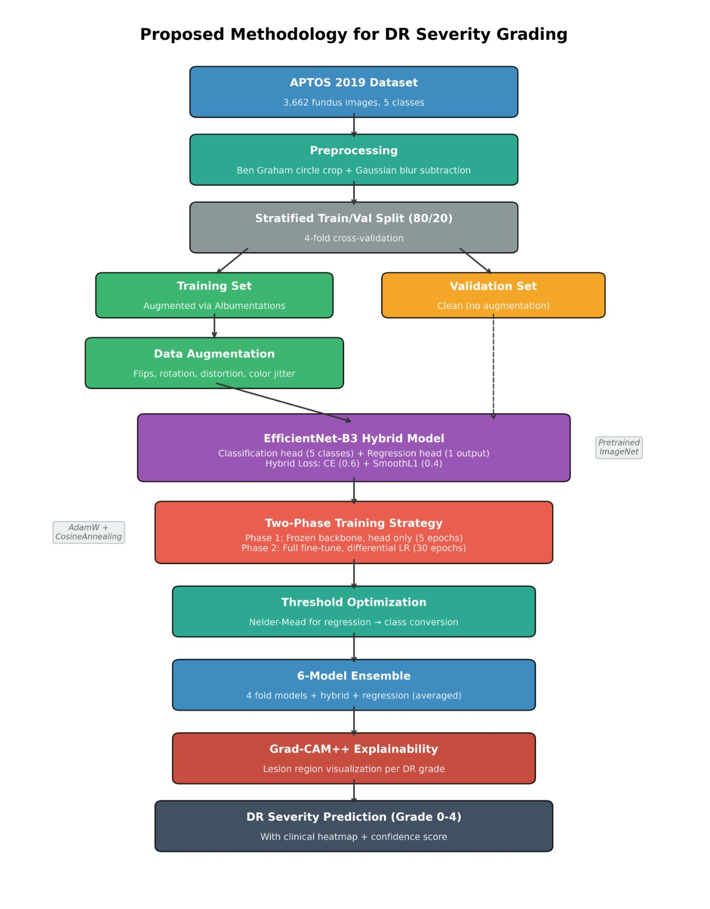

# 🔬 Hybrid Classification-Regression Framework for Diabetic Retinopathy Grading

<div align="center">


**Hybrid Classification-Regression Framework with Optimized Decision Thresholds for Ordinal Diabetic Retinopathy Grading on APTOS 2019**

*Aditi Sharma · Anjali · Astuti Mishra · Isha Sharma · Dr. Najme Zehra Naqvi*  
Dept. of Computer Science, Indira Gandhi Delhi Technical University for Women, New Delhi

</div>

---

## 📋 Table of Contents

- [Overview](#overview)
- [Key Results](#key-results)
- [Architecture](#architecture)
- [Dataset](#dataset)
- [Installation](#installation)
- [Project Structure](#project-structure)
- [Usage](#usage)
- [Methodology](#methodology)
- [Results](#results)
- [Explainability](#explainability)
- [Citation](#citation)

---

## Overview

Diabetic Retinopathy (DR) is a leading cause of preventable blindness, affecting over 30% of the 463 million patients with diabetes worldwide. This project presents a **hybrid dual-head deep learning framework** that grades DR severity into five classes (Grade 0–4) from fundus retinal photographs.

The key innovation is a shared **EfficientNet-B3 backbone** driving two parallel heads:
- A **Classification Head** (Cross-Entropy loss, weight 0.6) for categorical grade assignment
- A **Regression Head** (Smooth L1 / Huber loss, weight 0.4) for ordinal severity encoding

Decision thresholds from the regression output are optimized via **Nelder-Mead** to directly maximize **Quadratic Weighted Kappa (QWK)** — the clinically appropriate ordinal metric. A **6-model ensemble** and **Grad-CAM++ explainability** complete the pipeline.

---

## Key Results

| Strategy | Accuracy | QWK | Weighted F1 |
|---|---|---|---|
| 4-Fold CV (mean ± std) | 82.49% ± 1.50% | **0.9131 ± 0.0015** | — |
| Classification Ensemble | **86.08%** | 0.9113 | 0.8551 |
| **Regression Ensemble** *(primary)* | 82.67% | **0.9202** ⭐ | 0.8309 |
| Weighted Blend (0.6/0.4) | 85.95% | 0.9121 | 0.8547 |

> ⭐ **QWK = 0.9202** is the highest reported ordinal performance on APTOS 2019 under rigorous stratified cross-validation.

**Per-fold CV results:**

| Fold | Accuracy | QWK |
|---|---|---|
| Fold 1 | 81.45% | 0.9120 |
| Fold 2 | 81.17% | 0.9117 |
| Fold 3 | 82.38% | 0.9131 |
| Fold 4 | 84.97% | 0.9156 |

---

## Architecture





**Training Strategy:**
- **Phase 1** (5 epochs): Frozen backbone, heads only — AdamW, LR = 1×10⁻³
- **Phase 2** (30 epochs): Full fine-tune — Differential LR (backbone: 3×10⁻⁵, heads: 5×10⁻⁴), Cosine Annealing

---

## Dataset

[APTOS 2019 Blindness Detection](https://www.kaggle.com/c/aptos2019-blindness-detection) (Kaggle)

| Grade | Class | Images | % |
|---|---|---|---|
| 0 | No DR | 1,805 | 49.3% |
| 1 | Mild NPDR | 370 | 10.1% |
| 2 | Moderate NPDR | 999 | 27.3% |
| 3 | Severe NPDR | 193 | 5.3% |
| 4 | Proliferative DR | 295 | 8.1% |
| **Total** | | **3,662** | **100%** |

Download the dataset from Kaggle and place it as:
```
aptos2019-blindness-detection/
├── train.csv
└── train_images/
    └── *.png
```

---

## Installation

```bash
# Clone the repository
git clone https://github.com/your-username/aptos-hybrid-dr-grading.git
cd aptos-hybrid-dr-grading

# Install dependencies
pip install torch torchvision timm albumentations opencv-python
pip install scikit-learn scipy matplotlib seaborn tqdm
pip install grad-cam
```

**Dependencies:**

| Package | Purpose |
|---|---|
| `torch`, `torchvision` | Deep learning framework |
| `timm` | EfficientNet-B3 pretrained backbone |
| `albumentations` | Image augmentation pipeline |
| `opencv-python` | Ben Graham preprocessing |
| `scikit-learn` | Stratified K-Fold, metrics |
| `scipy` | Nelder-Mead threshold optimization |
| `grad-cam` | Grad-CAM++ explainability |

---

## Project Structure

```
aptos-hybrid-dr-grading/
│
├── APTOS_Hybrid.ipynb          # Main training notebook (Google Colab)
│
├── README.md
│
└── outputs/                    # Saved during training
    ├── best_regression_model.pth
    ├── best_hybrid_model.pth
    ├── best_fold_0.pth
    ├── best_fold_1.pth
    ├── best_fold_2.pth
    ├── best_fold_3.pth
    ├── training_curves_regression.png
    ├── confusion_matrix_regression.png
    ├── gradcam_explainability.png
    └── classification_report_regression.txt
```

---

## Usage

The full pipeline runs in `APTOS_Hybrid.ipynb`. Open it in Google Colab and run cells sequentially.

### 1. Mount Drive and Install

```python
from google.colab import drive
drive.mount('/content/drive')
!pip install timm albumentations grad-cam -q
```

### 2. Preprocessing

```python
def apply_ben_graham(img, size=288, sigmaX=10):
    img = crop_image_from_gray(img)          # Remove dark border
    img = cv2.resize(img, (size, size))
    img = cv2.addWeighted(img, 4,
              cv2.GaussianBlur(img, (0,0), sigmaX), -4, 128)
    return img
```

### 3. Define the Hybrid Model

```python
class DRHybrid(nn.Module):
    def __init__(self, model_name='efficientnet_b3', num_classes=5, dropout=0.3):
        super().__init__()
        self.backbone = timm.create_model(model_name, pretrained=True, num_classes=0)
        nf = self.backbone.num_features  # 1536
        self.dropout  = nn.Dropout(dropout)
        self.fc_class = nn.Linear(nf, num_classes)   # Classification head
        self.fc_reg   = nn.Linear(nf, 1)             # Regression head

    def forward(self, x):
        features = self.dropout(self.backbone(x))
        return self.fc_class(features), self.fc_reg(features).squeeze(-1)
```

### 4. Train

```python
model_h = DRHybrid('efficientnet_b3').to(device)
criterion_h = HybridLoss(cls_weight=0.6, reg_weight=0.4)

# Phase 1: head warming (5 epochs)
model_h.freeze_backbone()
# Phase 2: full fine-tune (30 epochs, differential LR)
model_h.unfreeze_backbone()
```

### 5. Threshold Optimization

```python
def optimize_thresholds(preds, labels):
    def kappa_loss(thresholds):
        t = sorted(thresholds)
        classes = np.digitize(preds, t)
        return -cohen_kappa_score(labels, classes, weights='quadratic')
    result = minimize(kappa_loss, [0.5, 1.5, 2.5, 3.5], method='Nelder-Mead')
    return sorted(result.x)
```

### 6. Run 4-Fold Cross-Validation

```python
skf = StratifiedKFold(n_splits=4, shuffle=True, random_state=42)
for fold, (train_idx, val_idx) in enumerate(skf.split(df, df['diagnosis'])):
    # Train fresh model per fold, save best checkpoint
    ...
```

### 7. Grad-CAM++ Explainability

```python
from pytorch_grad_cam import GradCAMPlusPlus

target_layer = [model.backbone.conv_head]
cam = GradCAMPlusPlus(model=model, target_layers=target_layer)
grayscale_cam = cam(input_tensor=img_tensor, targets=[RegressionTarget()])[0]
```

---

## Methodology

The proposed framework follows a structured pipeline for diabetic retinopathy (DR) severity grading, combining preprocessing, hybrid deep learning, threshold optimization, and ensemble learning.

---

### Overall Pipeline

The complete workflow is illustrated below:



The pipeline consists of the following stages:

---

### 1. Dataset & Preprocessing

- Dataset: APTOS 2019 (3,662 retinal fundus images, 5 classes)
- Preprocessing steps:
  - Removal of dark borders using circular cropping
  - Resizing images to 224×224
  - Contrast enhancement using Ben Graham method
- Data augmentation:
  - Flips, rotations, distortions, HSV jitter
- Class imbalance handled using weighted sampling

---

### 2️. Stratified Cross-Validation

- Dataset split using **Stratified 4-Fold Cross-Validation**
- Maintains equal class distribution in each fold
- Ensures robust and unbiased model evaluation

---

### 3️. Hybrid EfficientNet-B3 Model


- Backbone: EfficientNet-B3 (pretrained on ImageNet)
- Feature Extraction:
  - Global Average Pooling → 1536-dimensional feature vector
- Regularization:
  - Dropout (p = 0.3)

---

### 4️. Dual-Head Architecture

#### 🔹 Classification Head
- Linear layer (1536 → 5)
- Softmax activation
- Outputs class probabilities

#### 🔹 Regression Head
- Linear layer (1536 → 1)
- Outputs continuous severity score

This hybrid design captures both:
- Categorical predictions (classification)
- Ordinal relationships (regression)

---

### 5️. Training Strategy

#### Phase 1:
- Backbone frozen
- Only heads trained

#### Phase 2:
- Full model fine-tuned
- Differential learning rates:
  - Backbone → small LR
  - Heads → higher LR

---

### 6️. Loss Function

Hybrid loss is used:

L = 0.6 × CrossEntropy + 0.4 × SmoothL1

- Cross-Entropy → classification accuracy
- Smooth L1 → regression stability

---

### 7️. Threshold Optimization

- Regression outputs are continuous values
- Converted to discrete classes using thresholds

Initial thresholds:
[0.5, 1.5, 2.5, 3.5]


- Optimized using **Nelder-Mead method**
- Objective: maximize Quadratic Weighted Kappa (QWK)

---

### 8️. Ensemble Method

A 6-model ensemble is used:

- 4 models from cross-validation
- 1 hybrid model
- 1 regression-only model

Combination:
- Softmax averaging (classification)
- Regression averaging
- Final weighted fusion:
  - 0.6 (classification)
  - 0.4 (regression)

---

### 9️. Explainability

- Grad-CAM++ is applied
- Highlights important retinal regions
- Improves interpretability of predictions

---

### 10. Final Output

- DR severity grade (0–4)
- Confidence score
- Visual explanation (heatmap)

---

### Hyperparameters

| Parameter | Value |
|---|---|
| Backbone | EfficientNet-B3 (ImageNet-pretrained) |
| Input / Batch | 288×288 / 16 |
| Optimizer | AdamW |
| Phase 1 LR (heads) | 1×10⁻³ |
| Phase 2 LR (backbone) | 3×10⁻⁵ |
| Phase 2 LR (heads) | 5×10⁻⁴ |
| Weight Decay | 1×10⁻⁴ |
| Epochs (Ph.1 / Ph.2) | 5 / 30 |
| LR Schedule | Cosine Annealing |
| Label Smoothing / Dropout | 0.1 / 0.3 |
| Cross-Validation | Stratified 4-Fold |

### 6-Model Ensemble

| # | Model | Training Data |
|---|---|---|
| 1–4 | DRHybrid (CV folds 1–4) | 75% each (different splits) |
| 5 | DRHybrid (standalone) | Full 80% training set |
| 6 | DRRegression (pure regression) | Full 80% training set |

---

## Results

### Per-Class Metrics — Regression Ensemble (N = 733)

| Class | Precision | Recall | F1 | N |
|---|---|---|---|---|
| No DR | 0.986 | 0.970 | 0.978 | 361 |
| Mild NPDR | 0.646 | 0.716 | 0.679 | 74 |
| Moderate NPDR | 0.796 | 0.780 | 0.788 | 200 |
| Severe NPDR | 0.323 | 0.513 | 0.396 | 39 |
| Proliferative DR | 0.711 | 0.458 | 0.557 | 59 |
| **Weighted avg** | **0.842** | **0.827** | **0.831** | **733** |

### Clinical Safety Analysis
- **127 misclassifications** out of 733 samples (17.3%)
- **108 errors (85%)** between adjacent grades only
- **0 extreme misclassifications** — Proliferative DR never predicted as No DR, Mild, or Moderate

### Comparison with Prior Work on APTOS 2019

| Study | Task | Accuracy | QWK | CV |
|---|---|---|---|---|
| Gangwar (2021) | 5-class | 82.2% | — | No |
| Kobat (2022) | 5-class | 85.9% | 0.784 | 10-fold |
| Wahab Sait (2023)† | 5-class | 98.0% | 0.911 | No |
| Alwakid (2023)‡ | 5-class | 98.7% | — | No |
| **Ours — Cls Ensemble** | **5-class** | **86.1%** | **0.911** | **4-fold** |
| **Ours — Reg Ensemble** | **5-class** | **82.7%** | **0.920 ⭐** | **4-fold** |

> † Non-standard 5,590-image dataset.  ‡ ESRGAN preprocessing; drops to 79.7% on DDR dataset.

---

## Explainability

Grad-CAM++ heatmaps validate that the model attends to clinically meaningful retinal structures:

| Grade | Observed Attention Pattern |
|---|---|
| 0 — No DR | Diffuse attention over optic disc and macula |
| 1 — Mild NPDR | Concentrated on peripheral microaneurysm spots |
| 2 — Moderate NPDR | Focal attention on haemorrhage and exudate regions |
| 3 — Severe NPDR | Progressively wider haemorrhage attention across quadrants |
| 4 — Proliferative DR | Strong attention at optic disc margin and retinal periphery (neovascularization) |

Attention patterns are consistent with known lesion localization for each DR grade, confirming the model learns genuine pathological features rather than image artifacts.

---

## Citation

If you use this work, please cite:

```bibtex
@article{sharma2026hybrid,
  title   = {Hybrid Classification-Regression Framework with Optimized Decision
             Thresholds for Ordinal Diabetic Retinopathy Grading on APTOS 2019},
  author  = {Sharma, Aditi and Anjali and Mishra, Astuti and
             Sharma, Isha and Naqvi, Najme Zehra},
  journal = {Major Research Project Report, IGDTUW},
  year    = {2026}
}
```

---

<div align="center">
  <sub>Dept. of Computer Science · Indira Gandhi Delhi Technical University for Women · New Delhi · 2026</sub>
</div>
